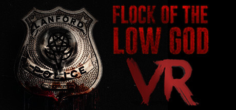

# PORTFOLIO
#### Game Programmer

AI | VR | UNREAL ENGINE 5 | UNITY | C++ | C# | SYSTEMS DESIGN

Experienced **VR/AR Developer** and **Project Lead** with proven success in commercial and educational applications. 
Technical expertise in **AI systems**, **game optimization**, and **gameplay systems** combined with **leadership experience** 
as both an instructor and developer. Seeking to contribute technical and creative problem-solving skills to 
innovative game development teams.

---
## PROFESSIONAL EXPERIENCE
---
### ACADEMY OF INTERACTIVE ENTERTAINMENT
#### Game Programming Instructor | 2023 - 2025
- **Technical Instruction** : Programming fundamentals, **AI**, **UI**, **Unity**, **Unreal Engine**, game math, custom engines, physics, rendering 
- **Project Leadership**: Guided student teams through agile workflow, maintained 92%+ class average

### TOP RIGHT CORNER
#### VR Developer | 2020-2024
- **VR Development**: Systems, gameplay, **AI**, **UI**, lighting, optimization, audio for commercial and educational applications
- **Commercial Success**: Developed "Flock of the Low God" (horror VR) and DLC for "The Atlas Mystery" (4.6 stars on Meta Quest Store)
- **Client Solutions**: Created VR training applications for Louisiana Economic Development and University of New Orleans

---
## KEY PROJECTS
---
### [FLOCK OF THE LOW GOD](https://store.steampowered.com/app/2093550/Flock_of_the_Low_God/) | VR Horror Game
*VR | AI | AUDIO | PLAYER INTERACTION | UNITY*

- Developed complex **perception-based AI system** with behavior trees for organic enemy movement and behavior
- Implemented **immersive audio system** designed to maximize player tension
- Programmed comprehensive player interaction systems and tutorial mechanics

### PROXIMO ONE | Multiplayer Sci-Fi FPS (In Development)
*NETWORKING | MULTIPLAYER | CHARACTER SYSTEMS | AI | UI | UNREAL*

- Building client-server architecture with client prediction for smooth multiplayer sync
- Designed weapons system to enable player build variety
- Programmed ledge-grabbing and sliding character movement abilities for enhanced player traversal

### EDUCATIONAL VR SIMULATIONS
*VR | UI | INTERACTION DESIGN | UNITY*

- **Solo-developed** multiple educational applications for university and government clients
- Created immersive **simulations** for chemistry, metallurgy, and renewable energy education
- Designed for first-time VR users with emphasis on comfort and intuitive interactions